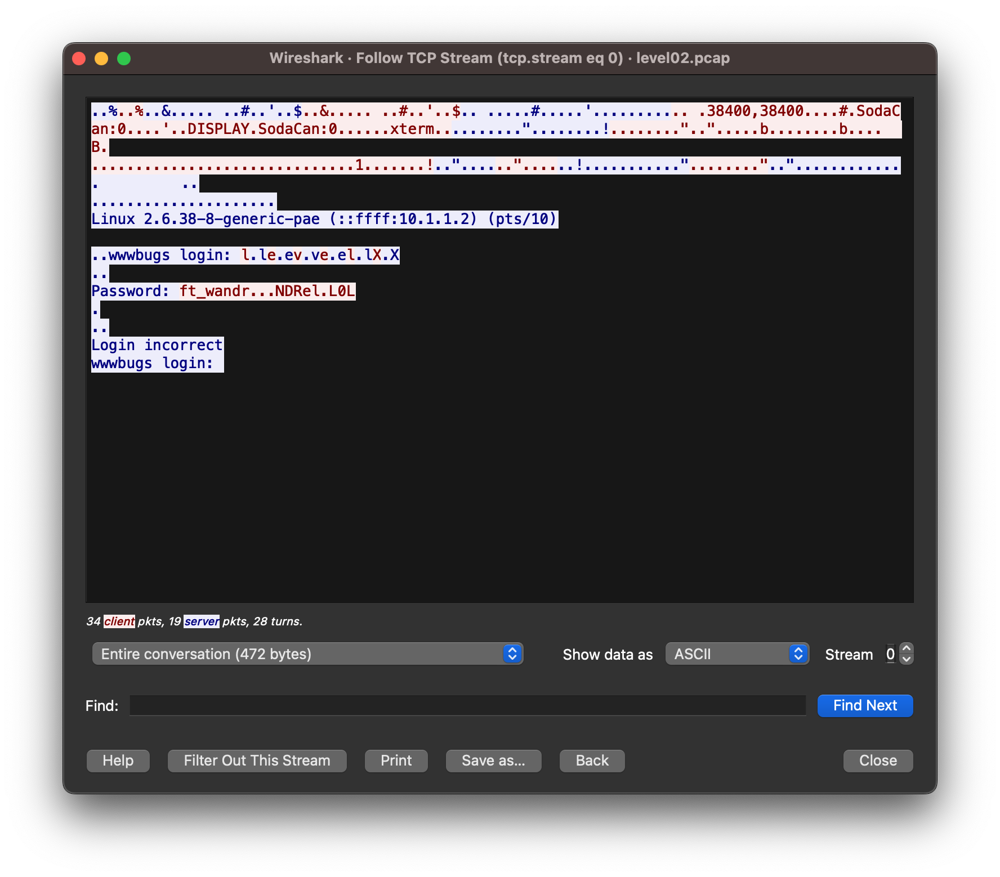

# Level 02

Upon logging in as `level02` we see a capture file `level02.pcap`, let's copy it to our attack box and open it with `tshark`

```bash
bash-3.2$ scp -P 4242 level02@10.30.168.109:/home/user/level02/level02.pcap level02.pcap
	   _____                      _____               _
	  / ____|                    / ____|             | |
	 | (___  _ __   _____      _| |     _ __ __ _ ___| |__
	  \___ \| '_ \ / _ \ \ /\ / / |    | '__/ _` / __| '_ \
	  ____) | | | | (_) \ V  V /| |____| | | (_| \__ \ | | |
	 |_____/|_| |_|\___/ \_/\_/  \_____|_|  \__,_|___/_| |_|

  Good luck & Have fun

          10.30.168.109
level02@10.30.168.109's password:
level02.pcap                                  100% 8302     4.7MB/s   00:00
```

```bash
bash-3.2$ tshark -r level02.pcap
    1   0.000000 59.233.235.218 → 59.233.235.223 TCP 74 39247 → 12121 [SYN] Seq=0 Win=14600 Len=0 MSS=1460 SACK_PERM TSval=18592800 TSecr=0 WS=128
    2   0.000128 59.233.235.223 → 59.233.235.218 TCP 74 12121 → 39247 [SYN, ACK] Seq=0 Ack=1 Win=14480 Len=0 MSS=1460 SACK_PERM TSval=46280417 TSecr=18592800 WS=32
    3   0.000390 59.233.235.218 → 59.233.235.223 TCP 66 39247 → 12121 [ACK] Seq=1 Ack=1 Win=14720 Len=0 TSval=18592800 TSecr=46280417
    4   0.036008 59.233.235.223 → 59.233.235.218 TCP 69 12121 → 39247 [PSH, ACK] Seq=1 Ack=1 Win=14496 Len=3 TSval=46280426 TSecr=18592800
    5   0.036255 59.233.235.218 → 59.233.235.223 TCP 66 39247 → 12121 [ACK] Seq=1 Ack=4 Win=14720 Len=0 TSval=18592804 TSecr=46280426
    6   0.036276 59.233.235.218 → 59.233.235.223 TCP 69 39247 → 12121 [PSH, ACK] Seq=1 Ack=4 Win=14720 Len=3 
	[...... SNIP........]
	TSval=18592804 TSecr=46280426
    .697744 59.233.235.223 → 59.233.235.218 TCP 66 12121 → 39247 [ACK] Seq=228 Ack=207 Win=14496 Len=0 TSval=46288842 TSecr=18596170
   87  33.705420 59.233.235.223 → 59.233.235.218 TCP 69 12121 → 39247 [PSH, ACK] Seq=228 Ack=207 Win=14496 Len=3 TSval=46288844 TSecr=18596170
   88  33.705616 59.233.235.218 → 59.233.235.223 TCP 66 39247 → 12121 [ACK] Seq=207 Ack=231 Win=14720 Len=0 TSval=18596170 TSecr=46288844
   89  36.462504 59.233.235.223 → 59.233.235.218 TCP 67 12121 → 39247 [PSH, ACK] Seq=231 Ack=207 Win=14496 Len=1 TSval=46289533 TSecr=18596170
   90  36.462761 59.233.235.218 → 59.233.235.223 TCP 66 39247 → 12121 [ACK] Seq=207 Ack=232 Win=14720 Len=0 TSval=18596446 TSecr=46289533
   91  36.462858 59.233.235.223 → 59.233.235.218 TCP 101 12121 → 39247 [PSH, ACK] Seq=232 Ack=207 Win=14496 Len=35 TSval=46289533 TSecr=18596446
   92  36.463013 59.233.235.218 → 59.233.235.223 TCP 66 39247 → 12121 [ACK] Seq=207 Ack=267 Win=14720 Len=0 TSval=18596446 TSecr=46289533
   93  42.109464 59.233.235.218 → 59.233.235.223 TCP 66 39247 → 12121 [FIN, ACK] Seq=207 Ack=267 Win=14720 Len=0 TSval=18597011 TSecr=46289533
   94  42.110028 59.233.235.223 → 59.233.235.218 TCP 66 12121 → 39247 [FIN, ACK] Seq=267 Ack=208 Win=14496 Len=0 TSval=46290945 TSecr=18597011
   95  42.110236 59.233.235.218 → 59.233.235.223 TCP 66 39247 → 12121 [ACK] Seq=208 Ack=268 Win=14720 Len=0 TSval=18597011 TSecr=46290945
bash-3.2$
```

We can see that the capture contains a TCP connection between `59.233.235.218` and `59.233.235.223`, let's follow the TCP stream



We can see that levelxx` is try to login using the  password `ft_waNDReL0L` , let's try to use it to to login as flag02

```bash
level02@SnowCrash:~$ su flag02
Password:
Don't forget to launch getflag
```

and it works !


